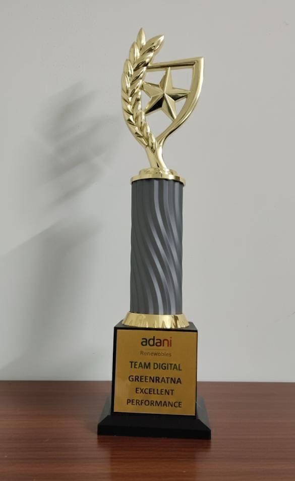
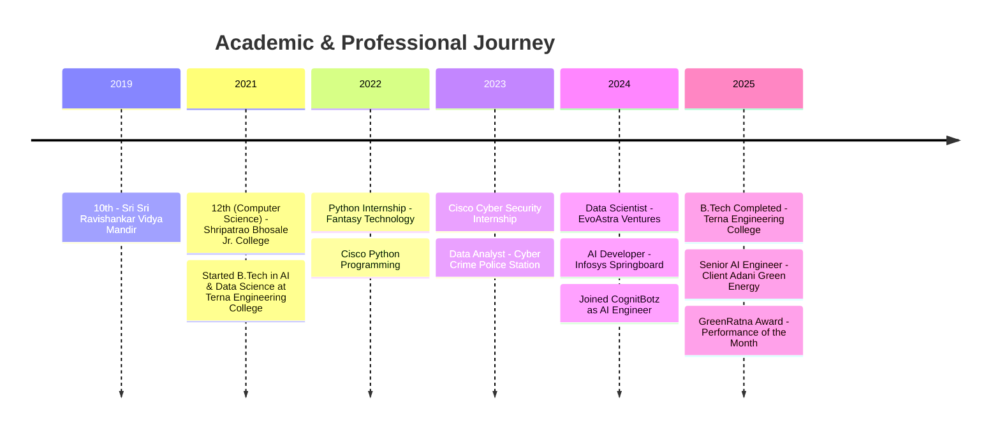
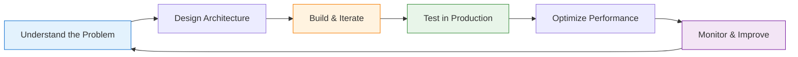

 

  

 

<!-- Quick Stats Row -->

  

---

## 🔭 What I'm Focused On Right Now

> Building **production-grade agentic AI systems** at Adani Green Energy — automating regulatory workflows, designing AI portals, and shipping multi-agent pipelines that leadership and stakeholders notice.

---

## 👋 About Me

> *"I don't just build prototypes — I deploy production AI systems that create real business value."*

I'm a **Full Stack AI Engineer** at **CognitBotz**, deployed at **Adani Green Energy Limited (AGEL)**. I specialize in building end-to-end AI applications — from complex multi-agent RAG architectures to polished React frontends. My AI portal and projects at AGEL were appreciated by **Hon'ble Chairman Shri Gautam Adani** and recognized across multiple leadership teams.

| 🕐 1,000+ hrs automated/year | ⚡ 8s → 500ms API latency | 📊 92% document AI accuracy | 🧠 30% NLP efficiency gain |
|---|---|---|---|

---

## 🏆 Recognition & Awards

### 🥇 GreenRatna Award — Performance of the Month (December 2025)
**Adani Green Energy Limited · Team Digital**

> Awarded for designing and delivering **AI-driven solutions and portals for AGEL**, recognized for innovation, efficiency, and real business impact. AI initiatives appreciated by **Hon'ble Chairman Shri Gautam Adani** and stakeholders across the organization.

---

## 🛠️ Tech Stack

### Languages & Core

### AI / ML Engineering

### Full Stack Development

### MLOps, Data & Automation

### Infrastructure & Databases

### 🧭 Tech Radar

| Stage | Technologies |
|-------|-------------|
| ✅ **Adopt** | LangGraph · RAG · FastAPI · Docker · LangChain · React · PostgreSQL · Azure AI Foundry |
| 🔬 **Trial** | n8n · Databricks · OpenTelemetry · MCP (Model Context Protocol) · LangSmith |
| 🔭 **Assess** | Agno · Llama 4 · Gemini 2.0 · Small Language Models (Phi-4) · AI Agents on Edge |
| 🗄️ **Hold** | Monolithic ML pipelines · Single-model chatbots · Manual prompt management |

---

## 💼 Experience

<b>🏢 CognitBotz — AI Engineer · Nov 2024 – Present</b> (click to expand)

 

**Ahmedabad & Hyderabad, India | Client: Adani Green Energy Limited**

- 🤖 Architect and deploy **LLM-powered automation systems** using LangChain, LangGraph, Agno, and multi-agent frameworks
- 🔗 Design and ship **production APIs** integrating chatbots, Q&A systems, and web agents at scale
- 📄 Build **multimodal AI pipelines** handling text, documents, and identity verification
- 📊 Lead **LLM evaluation** — accuracy, relevance, fairness — and implement bias mitigation strategies
- 🔒 Drive **ethical AI practices**: data privacy, security, and safeguards against misuse
- 🏆 Received **GreenRatna Award (Dec 2025)** — Performance of the Month, recognized by Adani leadership

<b>🏢 Infosys Springboard — AI Developer · Sep 2024 – Dec 2024</b>

 

AI development projects under the Infosys Springboard program.

<b>🏢 EvoAstra Ventures — Data Scientist · Aug 2024 – Sep 2024</b>

 

- Built Streamlit AI app with Google Generative AI → **90%+ accuracy** on image description, multilingual translation & voice synthesis
- Developed BERT-based Q&A system → **30% NLP efficiency gain** and **20% accuracy improvement**
- Applied ElasticNet + MLflow for predictive modeling → **15% accuracy boost**

<b>🏢 Cyber Crime Police Station — Data Analyst · Oct 2023 – Jan 2024</b>

 

Managed credentials and extracted complaint data for the National Cyber Crime Reporting Portal. Maintained portal status and communicated resolutions directly with victims.

<b>🏢 Cisco Networking Academy — Cyber Security Intern · May 2023 – Jul 2023</b>

 

AICTE Virtual Internship in Cyber Security with Cisco.

---

## 🌟 Featured Projects

<b>🩺 Quantus Med — Enterprise Multimodal AI Diagnostic Platform</b>

 

Enterprise multimodal AI fusing medical vision + neural audio transcription for real-time clinical reasoning.

- ⚡ Sub-400ms inference via GROQ LPUs
- 🔄 Whisper-v3 (audio) + Gemini 1.5 Pro (vision) fusion pipeline
- 🔒 Automated PHI/PII scrubbing, HIPAA-ready architecture
- 🎨 3D clinical visualization via React + Three.js

**Stack**: FastAPI · React · TypeScript · Llama-3.3-70B · Gemini 1.5 Pro · Whisper-v3 · LangChain · Docker · Redis

🔗 [View Project](https://github.com/abhishekmane6122/Quantus-Med)

<b>🎓 Academic Assistant AI — Agentic RAG Expert System</b>

 

Upload question papers → get precise, subject-specific answers via RAG + autonomous multi-step reasoning.

**Stack**: LangChain · RAG · ChromaDB · Tesseract OCR · FastAPI

🔗 [View Project](https://github.com/abhishekmane6122/Academic-Assistant-AI)

<b>🤖 500 AI Agents Projects · ☁️ MLOps on GCP · 🌐 Azure Projects · 📄 Document OCR Analyzer</b>

 

- **[500 AI Agents](https://github.com/abhishekmane6122/500-AI-Agents-Projects)** — Task automation, conversational, research, creative, data analysis, and security agents
- **[MLOps on GCP](https://github.com/abhishekmane6122/mlops-on-gcp)** — CI/CD pipelines, drift detection, versioned artifacts, auto-scaling on Google Cloud
- **[Azure Projects](https://github.com/abhishekmane6122/Azure-Projects)** — Azure Cognitive Services, ML workflows, Data Lake, Security Center
- **[Document OCR Analyzer](https://github.com/abhishekmane6122/Document-Extraction-Using-OCR)** — ML-powered career recommendations from academic records
- **[Road Accident Dashboard](https://github.com/abhishekmane6122/Road-Accident-Data-Analysis-and-Visualization-Using-MS-Excel-Dashboard)** — Interactive Excel analytics and geographic visualization

---

## ✍️ Technical Writing — AI Architect Series on Substack

> Deep engineering articles on production AI systems, architecture patterns, and real deployment lessons.

<b>📚 View all 10 articles</b>

 

| Series | Article | Core Topics |
|--------|---------|-------------|
| **Week 1 · Part A** | **[Building Production Multi-Agent Systems with LangGraph](https://substack.com/@abhimane)** | Supervisor pattern · stateful graphs · cyclic workflows · shared memory |
| **Week 1 · Part B** | **[System Architecture: Nginx + FastAPI + DNS](https://substack.com/@abhimane)** | Reverse proxy · SSL/TLS termination · load balancing · DNS integration |
| **Week 2 · Part A** | **[Context Engineering: Complete Architect's Guide](https://substack.com/@abhimane)** | Context window as RAM · information hierarchy · dynamic context assembly |
| **Week 2 · Part B** | **[Enterprise RAG Systems: Prototype to Production](https://substack.com/@abhimane)** | Hybrid search · reranking · Azure AI Foundry · production RAG patterns |
| **Week 3 · Part A** | **[LLMOps: Engineering Production AI That Actually Works](https://substack.com/@abhimane)** | Prompt versioning · CI/CD pipelines · cost optimization · A/B testing |
| **Week 3 · Part B** | **[Multimodal AI Architecture: Vision, Language & Beyond](https://substack.com/@abhimane)** | Vision-language fusion · cross-modal attention · CLIP + Whisper + ViT |
| **Week 4 · Part A** | **[Small Language Models: Efficient AI That Actually Ships](https://substack.com/@abhimane)** | SLM vs LLM · domain fine-tuning · edge deployment · Phi-3.5 / LLaMA |
| **Week 4 · Part B** | **[AI Agent Protocols: MCP, Tool Integration & Standards](https://substack.com/@abhimane)** | Model Context Protocol · tool schemas · agent discovery & coordination |
| **Week 5 · Part A** | **[Agentic AI in Production: Research Hype to Reality](https://substack.com/@abhimane)** | ReAct pattern · business automation · real-world production agents |
| **Week 5 · Part B** | **[Production AI Observability: Monitoring, Logs & Debugging](https://substack.com/@abhimane)** | Metrics · distributed traces · Prometheus + Grafana + OpenTelemetry |

---

## 📊 GitHub Analytics

 

---

## 🎓 Education & Certifications

**B.Tech in AI & Data Science** — Terna Engineering College *(2021 – 2025)*

| Certification | Issuer |
|--------------|--------|
| ☁️ CCSK v4.1 Foundation | Cloud Security Alliance |
| 🐍 Basics of Python | Verified |
| 🌐 Cloud Bootcamp | Google for Developers @ GeeksforGeeks |
| 🔐 Cyber Security | Cisco / AICTE Virtual Internship |

---

## 🏆 Impact at a Glance

| Metric | Value |
|--------|-------|
| 🥇 GreenRatna Award | **Dec 2025 — Adani Green Energy** |
| ⏱️ Manual hours automated / year | **1,000+** |
| ⚡ API latency optimized | **8s → 500ms** |
| 📊 Document AI accuracy | **92%** |
| 🧠 NLP efficiency gain | **30%** |
| 🤖 Production AI systems shipped | **5+** |
| ✍️ Technical articles published | **10** |

---

## 🎨 Development Philosophy

### 🎯 Core Principles
1. **🚀 Production over Prototype** — build things that actually run at scale
2. **⚡ Performance Matters** — optimize latency, response time, and throughput
3. **🔒 Security by Design** — data privacy and ethical AI from the start
4. **🎨 Full Stack Ownership** — frontend to backend to deployment
5. **📊 Metrics-Driven** — measure real business impact, not just accuracy scores
6. **🔄 Continuous Learning** — stay at the frontier of agentic AI and LLMOps

---

## 📫 Let's Connect

**Open to:** Production AI/ML engineering · Full stack with AI integration · Agentic AI collaboration · Technical mentoring

*"Turning cutting-edge AI research into scalable, enterprise-grade solutions — recognized by those who matter."*

