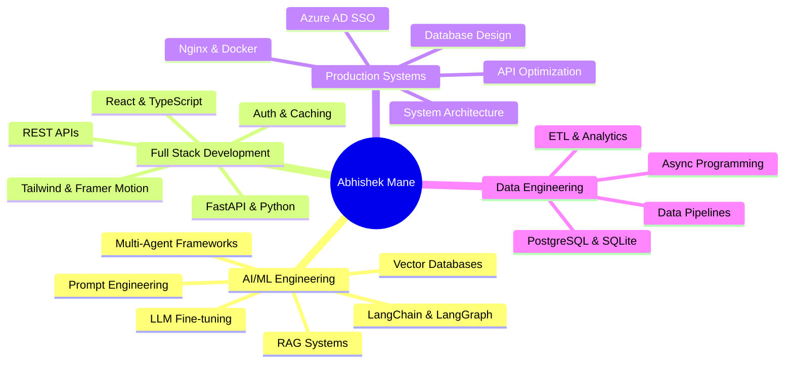
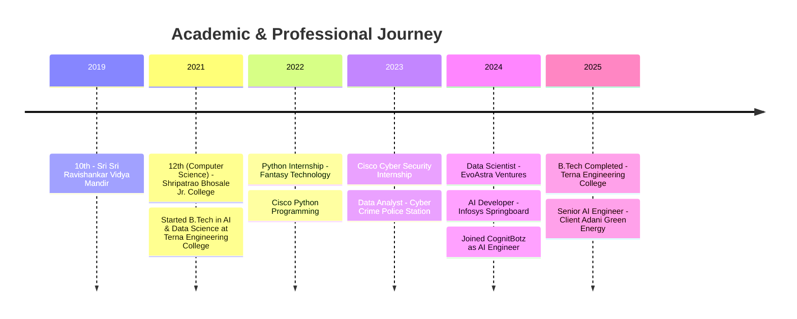
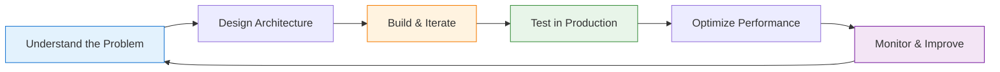

# 👨‍💻 Abhishek Mane

### AI Engineer | Full Stack Developer | Production AI Systems Architect

---

## 🎯 Professional Summary

> *"I don't just build prototypes — I deploy production AI systems that create real business value."*

Currently **AI Engineer @ CognitBotz** (Client: Adani Green Energy), I specialize in building **end-to-end AI applications** — from complex multi-agent RAG architectures to polished React frontends. My work has automated regulatory compliance workflows, reduced manual processing time by **1000+ hours annually**, and optimized API response times from **8 seconds to 500ms**.

### 🔥 What I Actually Do

---

## 🛠️ Technology Stack

### Languages & Frameworks

### AI/ML & LLM Stack

### Data Science & ML

### Frontend & UI

### Cloud, DevOps & Databases

---

## 💼 Experience

### 🏢 CognitBotz — AI Engineer
**Nov 2024 – Present · 1 yr 5 months | Ahmedabad & Hyderabad, India**
*Client: Adani Green Energy*

- 🤖 Develop and fine-tune LLMs using LangChain, Agno, and multi-agent frameworks tailored to specific business workflows
- 🔗 Design and deploy APIs for seamless LLM integration — chatbots, Q&A systems, and web agents in production
- 📄 Build multimodal AI applications handling text, documents, and identity verification at scale
- 📊 Evaluate LLM performance (accuracy, relevance, fairness) and implement bias mitigation strategies
- 🔒 Lead ethical AI practices: data privacy, security, and safeguards against misuse and harmful content

---

### 🏢 Infosys Springboard — AI Developer
**Sep 2024 – Dec 2024 · 4 months | India**

- Worked on AI development projects under the Infosys Springboard program

---

### 🏢 EvoAstra Ventures — Data Scientist
**Aug 2024 – Sep 2024 · 2 months | India**

- 🎯 Built a Streamlit AI app using Google Generative AI for image descriptions, multilingual translations, and voice synthesis — **90%+ accuracy**
- 🧠 Developed a Q&A system using pre-trained BERT, improving NLP task efficiency by **30%** and answer accuracy by **20%**
- 📈 Applied ElasticNet + MLflow for wine quality prediction, boosting accuracy by **15%**

---

### 🏢 Cyber Crime Police Station — Data Analyst
**Oct 2023 – Jan 2024 · 4 months | Osmanabad, India**

- Managed credentials and extracted complaint data for the National Cyber Crime Reporting Portal
- Maintained portal status updates and communicated case resolutions directly with victims

---

### 🏢 Cisco Networking Academy — Cyber Security Intern
**May 2023 – Jul 2023 · 3 months | Osmanabad, India**

- AICTE Virtual Internship in Cyber Security with Cisco

---

## 🌟 Featured Projects

### 🩺 [Quantus Med](https://github.com/abhishekmane6122/Quantus-Med) — Enterprise Multimodal AI Diagnostic Platform

Enterprise-grade multimodal AI platform fusing medical vision with neural transcription for real-time clinical reasoning.

- ⚡ **Sub-400ms Inference** via GROQ LPUs
- 🔄 **Multimodal Fusion**: Clinical audio (Whisper-v3) + medical imaging (Gemini 1.5 Pro)
- 🔒 **HIPAA-Ready**: Automated PHI/PII scrubbing
- 🎨 **3D Clinical Visualization** via React + Three.js

**Stack**: FastAPI · React · TypeScript · Llama-3.3-70B · Gemini 1.5 Pro · Whisper-v3 · LangChain · Docker · Redis

---

### 🎓 [Academic Assistant AI](https://github.com/abhishekmane6122/Academic-Assistant-AI) — Agentic Academic Expert System

Upload question papers, get precise subject-specific answers instantly using RAG + agentic AI reasoning.

- 📄 **Document Intelligence**: Advanced OCR and document parsing
- 💡 **Contextual Answers**: RAG-powered with citation and explanation
- 🤖 **Agentic Reasoning**: Autonomous multi-step problem-solving

**Stack**: LangChain · RAG · ChromaDB · Tesseract · FastAPI · Python

---

### 📄 [Document Extraction Using OCR](https://github.com/abhishekmane6122/Document-Extraction-Using-OCR) — Academic Records Analyzer

Web-based system to extract and analyze academic records with ML-powered career recommendations.

**Stack**: Tesseract · OpenCV · scikit-learn · Flask/FastAPI · Python

---

### 🤖 [500 AI Agents Projects](https://github.com/abhishekmane6122/500-AI-Agents-Projects) — Comprehensive AI Agents Collection

Extensive collection of AI agent implementations — task automation, conversational agents, research agents, creative agents, data analysis, and security agents.

---

### ☁️ [MLOps on GCP](https://github.com/abhishekmane6122/mlops-on-gcp) — Production ML Pipeline

Production-grade MLOps on Google Cloud Platform with automated CI/CD pipelines, model monitoring, drift detection, and auto-scaling endpoints.

---

### 🌐 [Azure Projects](https://github.com/abhishekmane6122/Azure-Projects) — Cloud AI Solutions

Azure Cognitive Services, Azure ML end-to-end workflows, Data Lake, Cosmos DB, and Azure Security Center implementations.

---

### 🚗 [Road Accident Data Analysis](https://github.com/abhishekmane6122/Road-Accident-Data-Analysis-and-Visualization-Using-MS-Excel-Dashboard) — Excel Analytics Dashboard

Interactive dashboards, trend analysis, and geographic visualization of road accident patterns using advanced Excel.

---

### 💼 Additional Projects

<table>
<tr>
<td width="50%">

#### 🏢 [Infosys Project Deployment](https://github.com/abhishekmane6122/Infosys-Project-Deployment-)
Enterprise-level project deployment and CI/CD management

**Tech**: Python · Cloud · CI/CD

</td>
<td width="50%">

#### 🤖 [Generative AI Internship](https://github.com/abhishekmane6122/Generative-AI-Internship-Assignment-)
LLMs, Diffusion Models, and GANs from internship program

**Tech**: LLMs · Diffusion · GANs

</td>
</tr>
<tr>
<td width="50%">

#### 📊 [Technohacks Data Science](https://github.com/abhishekmane6122/Technohacks-Data-Science-Internship-Task)
Data science internship tasks and solutions

**Tech**: Python · ML · Data Analysis

</td>
<td width="50%">

#### 🌐 [Cisco Virtual Internship](https://github.com/abhishekmane6122/Cisco-Virtual-Internship-Program-Python-Problem-Statement-2022)
Python-based networking and communication solutions

**Tech**: Python · Networking · APIs

</td>
</tr>
</table>

---

## 📊 GitHub Analytics

---

## 🎓 Education & Certifications

### 🎯 Certifications
- ☁️ **CCSK v4.1** — Cloud Security Foundation
- 🐍 **Basics of Python** — Verified
- 🌐 **Cloud Computing** — Google for Developers (GeeksforGeeks)
- 🔐 **Cisco Cyber Security** — AICTE Virtual Internship
- ☁️ **Cloud Bootcamp** — Google for Developers

---

## 💡 Skills Matrix

| Category | Skills | Proficiency |
|----------|--------|-------------|
| **AI/ML Engineering** | RAG, Multi-Agent, LangChain, LangGraph, LLM Fine-tuning | ⭐⭐⭐⭐⭐ |
| **LLMs & Tools** | Groq, Gemini, GPT, Claude, Azure AI Foundry, Prompt Engineering | ⭐⭐⭐⭐⭐ |
| **Full Stack** | FastAPI, React, TypeScript, Tailwind, Framer Motion | ⭐⭐⭐⭐⭐ |
| **Production Systems** | Nginx, Docker, Azure AD SSO, API Optimization | ⭐⭐⭐⭐ |
| **Data Engineering** | PostgreSQL, SQLite, Async Python, ETL Pipelines | ⭐⭐⭐⭐ |
| **Cloud & DevOps** | Azure, GCP, Docker, CI/CD, MLOps | ⭐⭐⭐⭐ |
| **Data Science** | Pandas, NumPy, scikit-learn, OpenCV, MLflow | ⭐⭐⭐⭐⭐ |
| **Security & Compliance** | Cyber Security, CCSK, Data Privacy, Ethical AI | ⭐⭐⭐⭐ |

---

## 🏆 Real Impact Numbers

| 🎯 Metric | 📊 Value |
|-----------|----------|
| **Manual hours automated** | 1000+ hrs/year |
| **Document analysis accuracy** | 92% |
| **API optimization** | 8s → 500ms |
| **NLP efficiency gain** | 30% |
| **ML accuracy improvement** | 15–20% |
| **Production AI systems** | 5+ deployed |

---

## 🎨 Development Philosophy

### 🎯 Core Principles
1. **🚀 Production over Prototype** — build things that actually run at scale
2. **⚡ Performance Matters** — optimize latency, response time, and throughput
3. **🔒 Security by Design** — data privacy and ethical AI from the start
4. **🎨 Full Stack Ownership** — frontend to backend to deployment
5. **📊 Metrics-Driven** — measure real business impact, not just accuracy scores
6. **🔄 Continuous Learning** — stay at the frontier of agentic AI and LLMOps

---

## 📫 Let's Connect

### Open to production AI/ML engineering roles, full stack positions with AI integration, and technical leadership in AI product development.

### 💬 Open to:
- 🤝 **Collaboration** on AI/ML and full stack projects
- 💼 **Production AI/ML engineering roles**
- 🤖 **Agentic AI and multi-agent systems** discussions
- 📚 **Mentoring** aspiring AI engineers
- 🎤 **Speaking** about RAG, LLMOps, and production AI

---

### 🌟 "Turning cutting-edge AI research into scalable, enterprise-grade solutions." 🌟

**⭐ Star my repositories if you find them useful! ⭐**

---

Built with ❤️ by Abhishek Mane | AI Engineer · Full Stack Developer · Production Systems Builder

