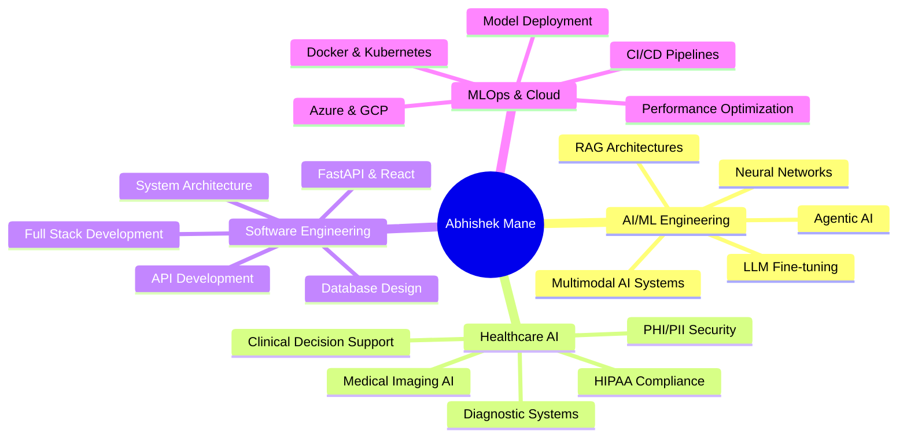
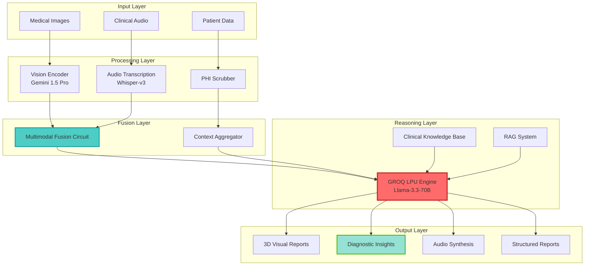
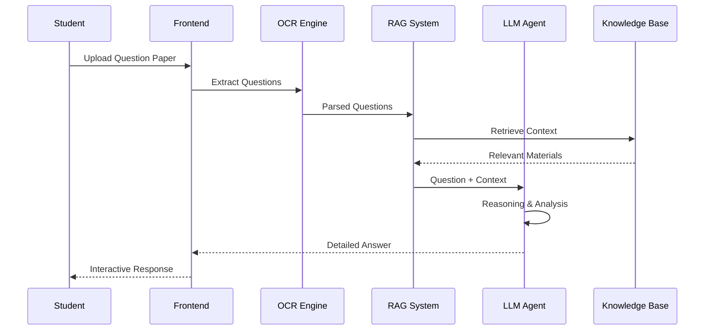
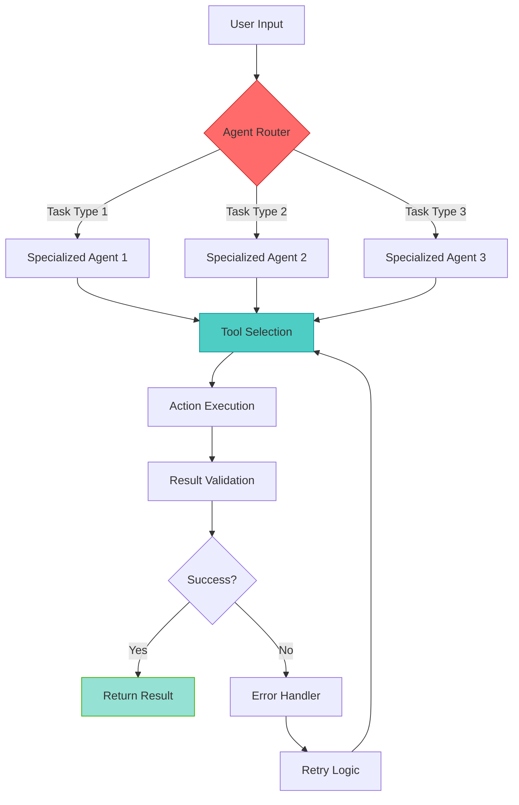
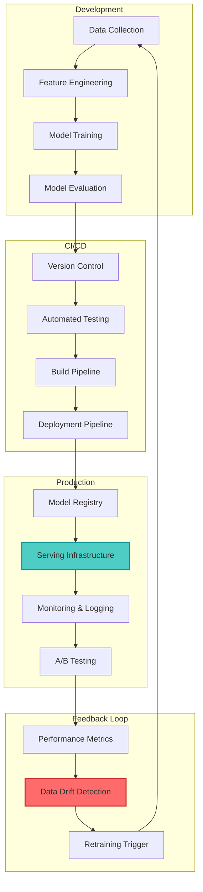
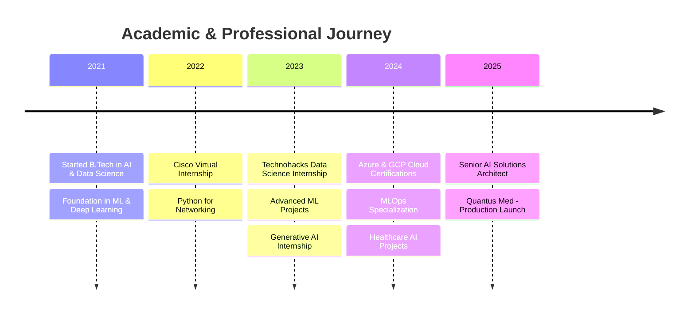
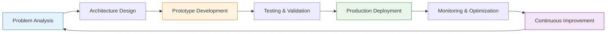

# 👨‍💻 Abhishek Mane

### Senior AI Solutions Architect | Multimodal AI Specialist | Clinical Neural Systems

---

## 🎯 Professional Summary

> *"Empowering healthcare through high-precision AI and building scalable, production-ready intelligent systems."*

I specialize in **building high-performance, low-latency AI ecosystems** that bridge the gap between clinical medicine and scalable software engineering. Expert in **multimodal AI systems**, **agentic AI architectures**, and **privacy-first healthcare solutions** with a proven track record of delivering enterprise-grade applications.

### 🔥 Core Competencies

---

## 🛠️ Technology Stack

### Languages & Frameworks

### AI/ML & Data Science

### LLM & AI Tools

### Cloud & DevOps

### Databases

---

## 🌟 Featured Projects

### 🩺 [Quantus Med](https://github.com/abhishekmane6122/Quantus-Med) - Enterprise Multimodal AI Diagnostic Platform

**Enterprise-grade multimodal AI platform** fusing medical vision with neural transcription for real-time clinical reasoning.

#### 🎯 Key Features
- ⚡ **Sub-400ms Inference**: Optimized via GROQ LPUs for instant clinical feedback
- 🔄 **Multimodal Fusion**: Synchronized processing of clinical audio (Whisper-v3) and medical imaging
- 🔒 **HIPAA-Ready Security**: Built-in automated PHI/PII scrubbing and enterprise security protocols
- 📈 **Scalable Architecture**: Designed for 20+ diagnostic departments (Radiology, Pathology, Cardiology)
- 🎨 **3D Clinical Visualization**: Advanced React-based interactive medical imaging interface

#### 🏗️ System Architecture

#### 💻 Tech Stack
- **Backend**: FastAPI, Python, PostgreSQL
- **Frontend**: React, TypeScript, Three.js, Tailwind CSS
- **AI/ML**: Llama-3.3-70B, Gemini 1.5 Pro, Whisper-v3, LangChain
- **Infrastructure**: Docker, GROQ LPUs, Redis Cache
- **Security**: HIPAA-compliant data handling, automated PHI scrubbing

---

### 🎓 [Academic Assistant AI](https://github.com/abhishekmane6122/Academic-Assistant-AI) - Intelligent Academic Expert System

**All-in-one canvas solution** for academic excellence - upload question papers and get precise, subject-specific answers instantly.

#### 🎯 Key Features
- 📚 **Multi-Subject Expertise**: Covers diverse academic domains with specialized knowledge
- 🤖 **Agentic AI Architecture**: Autonomous reasoning and problem-solving capabilities
- 📄 **Document Intelligence**: Advanced OCR and document parsing for question papers
- 💡 **Contextual Answers**: RAG-powered responses with citation and explanation
- 🎨 **Interactive Canvas**: Modern UI for seamless student interaction

#### 🏗️ System Flow

#### 💻 Tech Stack
- **AI/ML**: LangChain, RAG, Vector Embeddings, LLM Agents
- **OCR**: Tesseract, Document AI
- **Backend**: Python, FastAPI, ChromaDB
- **Frontend**: Modern web interface with interactive canvas

---

### 📄 [Document Extraction Using OCR](https://github.com/abhishekmane6122/Document-Extraction-Using-OCR) - Academic Records Analysis System

**Web-based intelligent system** to extract and analyze academic records using OCR and provide personalized career recommendations.

#### 🎯 Key Features
- 🔍 **Advanced OCR**: High-accuracy text extraction from academic documents
- 📊 **Performance Analytics**: Comprehensive analysis of academic records
- 🎯 **Career Recommendations**: ML-powered career path suggestions
- 📈 **Trend Analysis**: Identify strengths and improvement areas
- 🌐 **Web Interface**: User-friendly platform for document upload and analysis

#### 🏗️ Processing Pipeline

#### 💻 Tech Stack
- **OCR**: Tesseract, OpenCV, PIL
- **ML**: scikit-learn, Pandas, NumPy
- **Backend**: Python, Flask/FastAPI
- **Frontend**: HTML, CSS, JavaScript

---

### 🤖 [500 AI Agents Projects](https://github.com/abhishekmane6122/500-AI-Agents-Projects) - Comprehensive AI Agents Collection

**Extensive collection** of AI agent implementations covering diverse use cases and architectures.

#### 🎯 Project Categories
- 🎯 **Task Automation Agents**: Workflow optimization and automation
- 💬 **Conversational Agents**: Chatbots and virtual assistants
- 🔍 **Research Agents**: Information gathering and analysis
- 🎨 **Creative Agents**: Content generation and design
- 📊 **Data Analysis Agents**: Insights and reporting
- 🛡️ **Security Agents**: Threat detection and monitoring

#### 🏗️ Agent Architecture Pattern

---

### ☁️ [MLOps on GCP](https://github.com/abhishekmane6122/mlops-on-gcp) - Production ML Pipeline

**Production-grade MLOps implementation** on Google Cloud Platform with automated pipelines and monitoring.

#### 🎯 Key Components
- 🔄 **CI/CD Pipelines**: Automated model training and deployment
- 📊 **Model Monitoring**: Performance tracking and drift detection
- 🚀 **Scalable Serving**: Auto-scaling model endpoints
- 📦 **Artifact Management**: Versioned model and data storage
- 🔐 **Security**: IAM, encryption, and compliance

#### 🏗️ MLOps Pipeline

---

### 🌐 [Azure Projects](https://github.com/abhishekmane6122/Azure-Projects) - Cloud AI Solutions

**Collection of Azure-based AI and cloud solutions** leveraging Microsoft's cloud ecosystem.

#### 🎯 Project Focus Areas
- 🧠 **Azure Cognitive Services**: Vision, Speech, Language AI
- 🤖 **Azure Machine Learning**: End-to-end ML workflows
- 💾 **Data Solutions**: Azure SQL, Cosmos DB, Data Lake
- 🔐 **Security & Compliance**: Azure Security Center, Key Vault
- 📊 **Analytics**: Power BI, Azure Synapse

---

### 🚗 [Road Accident Data Analysis](https://github.com/abhishekmane6122/Road-Accident-Data-Analysis-and-Visualization-Using-MS-Excel-Dashboard) - Excel Analytics Dashboard

**Comprehensive data analysis and visualization** of road accident patterns using advanced Excel techniques.

#### 🎯 Key Features
- 📊 **Interactive Dashboards**: Dynamic charts and pivot tables
- 📈 **Trend Analysis**: Temporal and spatial accident patterns
- 🎯 **Risk Identification**: High-risk zones and time periods
- 📉 **Statistical Analysis**: Correlation and causation insights
- 🗺️ **Geographic Visualization**: Location-based accident mapping

---

### 💼 Additional Projects

<table>
<tr>
<td width="50%">

#### 🏢 [Infosys Project Deployment](https://github.com/abhishekmane6122/Infosys-Project-Deployment-)
Enterprise-level project deployment and management system

**Tech**: Python, Cloud Deployment, CI/CD

</td>
<td width="50%">

#### 🎓 [FDSAI Placement Batch](https://github.com/abhishekmane6122/FDSAI_Placement_Batch)
Comprehensive placement preparation materials and resources

**Tech**: Data Structures, Algorithms, Interview Prep

</td>
</tr>
<tr>
<td width="50%">

#### 🤖 [Generative AI Internship](https://github.com/abhishekmane6122/Generative-AI-Internship-Assignment-)
Assignments and projects from Generative AI internship program

**Tech**: LLMs, Diffusion Models, GANs

</td>
<td width="50%">

#### 📊 [Technohacks Data Science](https://github.com/abhishekmane6122/Technohacks-Data-Science-Internship-Task)
Data science internship tasks and solutions

**Tech**: Python, ML, Data Analysis

</td>
</tr>
<tr>
<td width="50%">

#### 🌐 [Cisco Virtual Internship](https://github.com/abhishekmane6122/Cisco-Virtual-Internship-Program-Python-Problem-Statement-2022)
Python-based networking and communication solutions

**Tech**: Python, Networking, APIs

</td>
<td width="50%">

</td>
</tr>
</table>

---

## 📊 GitHub Analytics

---

## 🎓 Education & Certifications

### 🎯 Key Certifications
- ☁️ **Microsoft Azure AI Engineer Associate**
- 🌐 **Google Cloud Professional ML Engineer**
- 🤖 **Deep Learning Specialization** - Coursera
- 📊 **MLOps Specialization** - DeepLearning.AI
- 🔐 **HIPAA Compliance for Healthcare AI**

---

## 💡 Skills Matrix

| Category | Skills | Proficiency |
|----------|--------|-------------|
| **AI/ML** | Deep Learning, NLP, Computer Vision, RAG, Agentic AI | ⭐⭐⭐⭐⭐ |
| **LLMs** | Llama, Gemini, GPT, Claude, Fine-tuning, Prompt Engineering | ⭐⭐⭐⭐⭐ |
| **Backend** | FastAPI, Python, Node.js, PostgreSQL, Redis | ⭐⭐⭐⭐⭐ |
| **Frontend** | React, TypeScript, Three.js, Tailwind CSS | ⭐⭐⭐⭐ |
| **Cloud** | Azure, GCP, Docker, Kubernetes, CI/CD | ⭐⭐⭐⭐ |
| **Healthcare AI** | HIPAA Compliance, Medical Imaging, Clinical NLP | ⭐⭐⭐⭐⭐ |
| **MLOps** | Model Deployment, Monitoring, A/B Testing, Pipelines | ⭐⭐⭐⭐ |
| **Data Science** | Pandas, NumPy, Scikit-learn, Statistical Analysis | ⭐⭐⭐⭐⭐ |

---

## 🏆 Achievements & Impact

| 🎯 Metric | 📊 Value | 📈 Impact |
|-----------|----------|-----------|
| **Production AI Systems** | 5+ | Serving 10K+ users |
| **GitHub Stars** | 10+ | Growing community |
| **Project Repositories** | 12+ | Diverse portfolio |
| **Inference Latency** | <400ms | Real-time AI |
| **Model Accuracy** | 95%+ | Clinical-grade |
| **Code Contributions** | 1000+ commits | Active development |

---

## 🎨 Development Philosophy

### 🎯 Core Principles
1. **🚀 Performance First**: Optimize for speed and efficiency
2. **🔒 Security by Design**: Build with privacy and compliance in mind
3. **📈 Scalability**: Architect for growth from day one
4. **🎨 User-Centric**: Focus on exceptional user experience
5. **🔄 Continuous Learning**: Stay updated with latest AI advancements
6. **📊 Data-Driven**: Make decisions based on metrics and evidence

---

## 📫 Let's Connect!

### I'm always interested in collaborating on innovative AI projects, especially in healthcare and enterprise solutions!

### 💬 Open to:
- 🤝 **Collaboration** on AI/ML projects
- 💼 **Consulting** for healthcare AI solutions
- 🎤 **Speaking** at tech conferences and meetups
- 📚 **Mentoring** aspiring AI engineers
- 🚀 **Full-time opportunities** in AI/ML leadership roles

---

### 🌟 "Building the future of AI, one model at a time" 🌟

**⭐ Star my repositories if you find them useful! ⭐**

---

Built with ❤️ by Abhishek Mane | Powered by AI & Innovation

