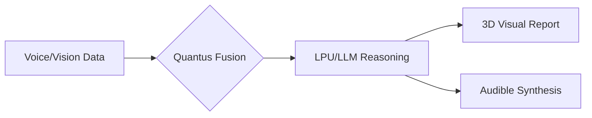

# Hi there, I'm Abhishek Mane 👋 
### Senior AI Solutions Architect | Multimodal AI Specialist | Clinical Neural Systems

I specialize in building high-performance, low-latency AI ecosystems that bridge the gap between clinical medicine and scalable software engineering. Expert in building low-latency multimodal systems and privacy-first healthcare architectures.

---

### 🛠️ Tech Stack & Expertise

- **AI/ML:** Llama-3, Gemini 1.5, Whisper-v3, Multimodal Fusion Circuits, Neural Reasoning.
- **High-Performance Inference:** GROQ LPUs (Ultra-low latency inference), GPU/LPU Co-design.
- **Backend:** FastAPI, Python, PostgreSQL, PII/PHI Data Scrubbing.
- **Frontend:** React, TypeScript, 3D Clinical Visualization, Tailwind CSS.
- **DevOps:** Docker, Docker-Compose, Git, Enterprise Security Protocols.

---

### 🩺 Star Project: [Quantus Med](https://github.com/abhishekmane6122/Quantus-Med)
**Enterprise-grade Multimodal AI Diagnostic Platform**
*Fusing Medical Vision with Neural Transcription for real-time clinical reasoning.*

- **Sub-400ms Inference:** Optimized via GROQ LPUs for instant clinical feedback.
- **Multimodal Fusion:** Synchronized processing of clinical audio (Whisper) and medical imaging.
- **Secure by Design:** Built-in HIPAA-ready protocols and automated PHI scrubbing.
- **Scalable Architecture:** Roadmap for 20+ diagnostic departments (Radiology, Pathology, etc.).

---

### 📊 GitHub Stats

---

### 📫 Let's Connect
- **LinkedIn:** [Abhishek Mane](https://www.linkedin.com/in/abhishek-mane-aiml/)
- **GitHub:** [abhishekmane6122](https://github.com/abhishekmane6122)

*"Empowering healthcare through high-precision AI."*
